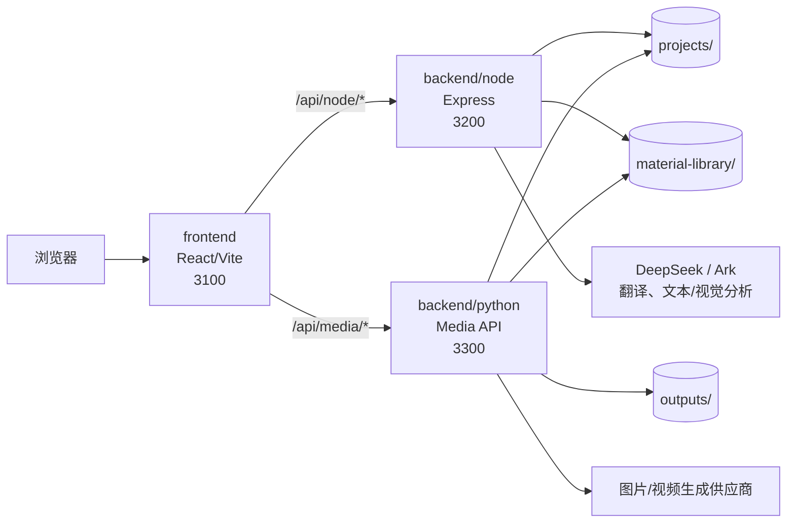

# AGENT.md

这份文档给后续维护者或 AI 代理使用。当前仓库已经不是单个 Vite 项目，而是一个本地 AI 图片/视频创作画布的多项目、多服务架构。处理代码时，要把用户工程、素材、生成结果、环境配置都视为真实本地数据，不能随意删除、覆盖或重写。

## 当前定位

Demiurge AI Canvas 是一个本地运行的 AI 多模态创作工作台。用户可以在节点画布里导入素材、连接图片/视频/文本节点、引用上游媒体、生成新资产、分析图片、保存可复用素材，并把整个创作过程持久化为本地工程。

核心目标：

- 多项目、多服务。
- 职责单一。
- 分层清晰。
- 边界明确。
- 功能完整可运行。
- 旧工程、旧素材、旧媒体路径保持兼容。

## 服务组成

当前运行时由三个项目组成：

```text
frontend       前端 React/Vite 应用，端口 3100
backend/node   Node API 服务，端口 3200
backend/python Python Media API 服务，端口 3300
```

不要恢复根目录 `package.json`，也不要把后端启动脚本重新塞回前端项目。

## 本地启动顺序

本地开发建议按顺序启动三个服务。

### 1. Node API

```powershell
cd backend\node
npm run dev
```

健康检查：

```text
http://127.0.0.1:3200/api/node/health
```

### 2. Python Media API

```powershell
cd backend\python
node run-image-service-dev.mjs
```

健康检查：

```text
http://127.0.0.1:3300/api/media/health
```

### 3. Frontend

```powershell
cd frontend
npm run dev
```

打开：

```text
http://127.0.0.1:3100
```

## 架构图



## 目录职责

### frontend

前端只负责 UI 和前端状态，不直接读写本地工程文件，不直接调用外部模型供应商。

```text
frontend/src/api          前端 API 封装、资源 URL 规范化
frontend/src/components   通用 UI 组件
frontend/src/features     功能模块
frontend/src/store        前端状态和 Context
frontend/src/utils        前端工具函数
frontend/src/styles       全局样式
```

当前 `frontend/src` 根目录只应保留应用入口和总编排文件，例如：

```text
frontend/src/main.jsx
frontend/src/App.jsx
```

### backend/node

Node 服务负责本地工程、素材库、翻译、分析、工程资产读写。

```text
backend/node/src/main.js               Express 入口
backend/node/src/routes/               路由注册
backend/node/src/controllers/          HTTP 入参/出参
backend/node/src/services/             业务流程和派生数据
backend/node/src/repositories/         本地文件/索引读写
backend/node/src/clients/              外部模型供应商客户端
backend/node/src/config/               环境变量、路径、存储配置
backend/node/src/utils/                HTTP 和媒体响应工具
backend/node/src/projects-api.mjs      旧路径兼容分发层
```

`projects-api.mjs` 现在只是薄兼容层。不要再把新业务逻辑塞回这个文件；新逻辑优先放入 controller/service/repository。

### backend/python

Python 服务负责图片生成、视频生成、视频任务、媒体文件访问和媒体处理。

```text
backend/python/app/image_generate_service.py 当前完整媒体运行时
backend/python/app/main.py                   FastAPI 壳入口
backend/python/app/core/                     配置、路径、基础设施
backend/python/app/routers/                  路由预留目录
backend/python/app/schemas/                  请求/响应结构预留目录
backend/python/app/services/                 媒体业务服务预留目录
backend/python/app/repositories/             文件读写预留目录
backend/python/app/models/                   模型对象预留目录
backend/python/app/utils/                    工具函数预留目录
```

`image_generate_service.py` 仍承载完整图片/视频生成能力。继续拆分时要小步迁移，拆一块测一块，不要一次性重写成 FastAPI 后丢功能。

## API 边界

前端业务 API 必须走：

```text
/api/node/*
/api/media/*
```

前端组件中不应新增裸 `fetch('/api/...')` 业务请求。新增业务请求时，应先放到 `frontend/src/api/`，再由组件调用。

当前保留旧路径兼容：

```text
/api/project/*
/api/material-library/*
/api/video-file/*
/api/generate-image
/api/generate-video
/api/video-task/*
/api/seedance-face-review
```

这些旧路径是为了读取历史工程和历史媒体，不代表新代码可以继续扩散旧 API 风格。

## 用户功能清单

改代码时必须保护这些能力：

- 创建、打开、重命名、复制、删除本地工程。
- 保存、加载、自动保存工程画布。
- 添加图片节点、视频节点、文本分析节点。
- 上传本地图片或视频。
- 节点连线引用上游素材。
- 提示词中使用 `@图片1` 等引用。
- 图片生成。
- 视频生成、任务轮询、视频文件读取。
- 翻译。
- 文本/视觉分析。
- 图片裁剪、标注、放大查看、下载、复用。
- 视频播放、静音、剪辑、截帧、下载、复用。
- 跨工程素材库保存、读取、删除。
- Seedance 主体库和人脸审核信息。
- 旧 `projects/`、`outputs/`、`material-library/` 数据继续可读。

## 本地数据

```text
projects/<slug>/project_data.json
projects/<slug>/assets/
```

每个工程的画布、节点、连线、视口和工程资产。

```text
material-library/library_data.json
material-library/seedance_subjects.json
material-library/assets/
```

跨工程素材库和 Seedance 主体数据。

```text
outputs/
```

未绑定工程的生成结果、临时输出或兼容输出。

除非用户明确要求，不要删除这些目录。不要为了“清爽”清掉用户数据。

## 环境变量

每个服务维护自己的环境变量：

```text
frontend/.env.local
backend/node/.env.local
backend/python/.env.local
```

示例文件：

```text
frontend/.env.example
backend/node/.env.example
backend/python/.env.example
```

不要把 `.env.local` 或真实 API Key 提交进仓库。

常见变量类别：

- DeepSeek：翻译、文本分析。
- Volcengine Ark：文本/视觉分析、图片/视频模型。
- VectorEngine / Gemini：图片生成网关。
- GPT Image：图片生成。
- Xunke / Seedance：视频生成和素材上传。
- DashScope：视频生成。
- ffmpeg：视频首帧、缩略图处理。

## 验证清单

有意义的改动完成后，至少执行：

```powershell
cd frontend
npm run build
```

```powershell
cd backend\node
npm run lint
```

```powershell
cd backend\python
python -m py_compile app\image_generate_service.py app\main.py app\core\config.py app\core\media_paths.py test_image_generate.py
```

核心冒烟：

- `http://127.0.0.1:3100` 正常打开。
- `http://127.0.0.1:3200/api/node/health` 正常。
- `http://127.0.0.1:3300/api/media/health` 正常。
- 项目列表正常。
- 项目 create/save/load/delete 闭环正常，并清理测试工程。
- 素材库列表正常。
- 旧图片 `/api/project/media/...` 返回 `200`。
- 旧视频 `/api/video-file/...` 返回 `200`。
- 浏览器首页无 broken image，无控制台错误。

真实图片/视频生成会消耗外部模型额度，除非用户明确要求，否则默认只验证服务、路由、媒体访问、任务接口和本地读写链路。

## 工程化约束

- 不要恢复单项目脚本堆叠。
- 不要把 Node/Python 后端命令塞进 `frontend/package.json`。
- 不要在根目录新增业务运行脚本。
- 不要把服务秘密放在根目录。
- 不要让前端直接承担后端逻辑。
- 不要让业务组件新增散落的裸 API 请求。
- 不要破坏旧工程数据兼容。
- 不要删除用户本地数据。
- 大文件继续拆分时，必须小步迁移、小步验证。

## 后续可深化方向

当前工程化基线已经成立。后续优化属于内部深化：

- 继续拆 `frontend/src/features/nodes/` 下的大节点组件。
- 将节点内部逻辑拆成 hooks、子组件和 feature services。
- 继续把 `backend/python/app/image_generate_service.py` 拆为 routers、schemas、services、clients、repositories。
- 逐步减少 Node 与 Python 对共享文件的直接读写，改为明确 API 调用。
- 为项目 CRUD、素材库、媒体文件访问补更系统的自动化测试。
