# Demiurge AI Canvas

Demiurge AI Canvas 是一个本地运行的 AI 图片/视频创作画布。项目已经拆分为多项目、多服务架构，目标是职责单一、边界清晰、长期可维护，而不是把所有能力堆在一个启动脚本里。

## 项目教程

### 这个项目是做什么的

Demiurge AI Canvas 是一个面向 AI 图片和视频创作的本地画布工具。它把“提示词、参考图、图片生成、视频生成、素材沉淀、工程保存”这些动作组织在一个可视化画布里，让创作过程不再只是一次性的聊天记录或零散文件。

用户可以在画布中创建不同类型的节点：

- 文本节点：整理创意、提示词、角色设定、场景描述。
- 图片节点：选择图片模型，使用提示词和参考图生成图片。
- 视频节点：基于提示词、图片参考和模型参数生成视频。
- 工程和素材库：保存项目画布、生成结果、跨项目复用素材。

项目更像一个“AI 创作工作台”：前端负责画布交互，后端负责工程数据和模型调用，Python 媒体服务负责生成图片、视频和文件访问。

### 解决了什么问题

这个项目主要解决 AI 视觉创作中的几个实际问题：

- **创作过程难以沉淀**：普通聊天式生成容易丢上下文，工程画布可以保存节点、连线、参数和生成结果。
- **素材复用困难**：生成出来的人物、场景、物品、风格素材可以进入素材库，后续项目继续使用。
- **图片和视频链路割裂**：图片生成、视频生成、任务轮询、视频文件读取统一接入同一个画布工作流。
- **本地数据不可控**：工程数据、素材库和输出文件都存放在本地或自有服务器的数据目录，不依赖第三方产品的项目管理能力。
- **多模型能力难管理**：前端提供模型配置，后端统一封装 DeepSeek、Ark、Xunke、DashScope、Gemini、VectorEngine 等供应商调用。

### 基本使用流程

典型创作流程如下：

1. 打开首页，创建或进入一个工程。
2. 在画布中添加文本、图片或视频节点。
3. 在文本节点中整理提示词或创意描述。
4. 在图片节点中选择模型，输入提示词和参考图，生成候选图片。
5. 将满意的图片保存为工程资产或素材库素材。
6. 在视频节点中使用图片和提示词生成视频任务。
7. 等待后端轮询任务完成，视频文件保存到工程资产或输出目录。
8. 保存工程，下次继续编辑同一个创作链路。

### 项目的编写逻辑

项目按“前端 UI、Node 业务 API、Python 媒体 API、本地数据目录”拆分，核心原则是每个服务只做自己最擅长的事。

```text
frontend/
  负责画布 UI、节点组件、用户交互、前端状态和 API 调用。

backend/node/
  负责工程管理、素材库、文本翻译、文本/图片分析，以及本地工程资产读写。

backend/python/
  负责图片生成、视频生成、视频任务查询、媒体文件访问和媒体处理。

projects/
  保存每个工程的 project_data.json 和工程资产。

material-library/
  保存跨工程素材库索引和素材文件。

outputs/
  保存未绑定具体工程的生成媒体、临时文件或兼容输出。
```

前端不会直接访问外部模型供应商。前端只调用本项目自己的 API：

- `/api/node/*`：交给 Node API。
- `/api/media/*`：交给 Python Media API。

这样做的好处是：

- API Key 不出现在浏览器里。
- 前端只关心创作交互，不关心供应商协议差异。
- 后端可以统一处理路径、安全校验、错误返回和兼容旧数据。
- 部署时可以用 Nginx 统一代理 API，避免跨域问题。

### 代码组织思路

前端代码按功能和职责拆分：

- `src/features/nodes/`：画布节点实现，例如图片节点、视频节点、文本节点。
- `src/features/projects/`：项目首页、工程列表、创建、加载、删除等入口体验。
- `src/api/`：前端 API 路径封装、资源 URL 规范化、素材库请求。
- `src/store/`：画布状态、节点 UI 状态、项目上下文。
- `src/components/`：可复用面板、工具栏、弹窗和通用 UI。

Node 后端按典型 API 分层：

- `routes/`：注册 HTTP 路由。
- `controllers/`：处理 HTTP 入参、出参和错误。
- `services/`：组织业务流程，例如资源 URL 规范化、预览图、分析流程。
- `repositories/`：读写本地工程文件、素材库索引和资产文件。
- `clients/`：封装外部模型供应商调用。
- `config/`：环境变量、路径和存储配置。

Python 后端当前保留完整媒体运行时：

- `app/image_generate_service.py`：当前完整图片/视频生成服务入口。
- `app/core/`：环境变量、路径解析、媒体路径上下文。
- `app/main.py`：FastAPI 壳入口，为后续继续拆分媒体 API 做准备。

整体开发思路是：先把能稳定运行的创作链路保留下来，再逐步把大文件拆成更清晰的模块，避免为了重构而破坏现有图片/视频生成能力。

## 系统图谱

这一组图按“从宏观到微观、从静态到动态”的顺序组织：先看 C4 模型前三层，再看数据如何流动，最后看关键业务的时序和核心实体状态。

### C4-1 上下文图

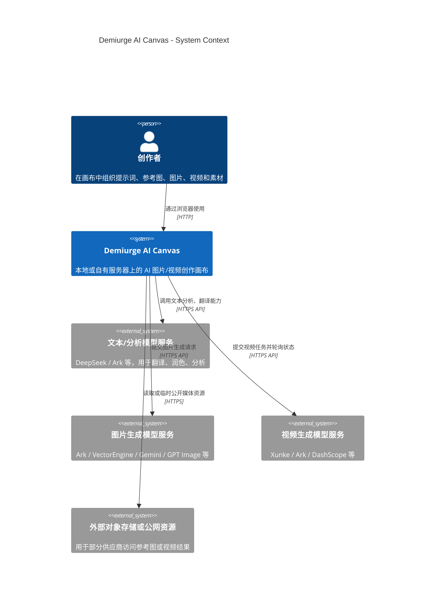
```mermaid
C4Context
  title Demiurge AI Canvas - System Context

  Person(creator, "创作者", "在画布中组织提示词、参考图、图片、视频和素材")
  System(canvas, "Demiurge AI Canvas", "本地或自有服务器上的 AI 图片/视频创作画布")

  System_Ext(textModels, "文本/分析模型服务", "DeepSeek / Ark 等，用于翻译、润色、分析")
  System_Ext(imageModels, "图片生成模型服务", "Ark / VectorEngine / Gemini / GPT Image 等")
  System_Ext(videoModels, "视频生成模型服务", "Xunke / Ark / DashScope 等")
  System_Ext(objectStorage, "外部对象存储或公网资源", "用于部分供应商访问参考图或视频结果")

  Rel(creator, canvas, "通过浏览器使用", "HTTP")
  Rel(canvas, textModels, "调用文本分析、翻译能力", "HTTPS API")
  Rel(canvas, imageModels, "提交图片生成请求", "HTTPS API")
  Rel(canvas, videoModels, "提交视频任务并轮询状态", "HTTPS API")
  Rel(canvas, objectStorage, "读取或临时公开媒体资源", "HTTPS")
```

### C4-2 容器图

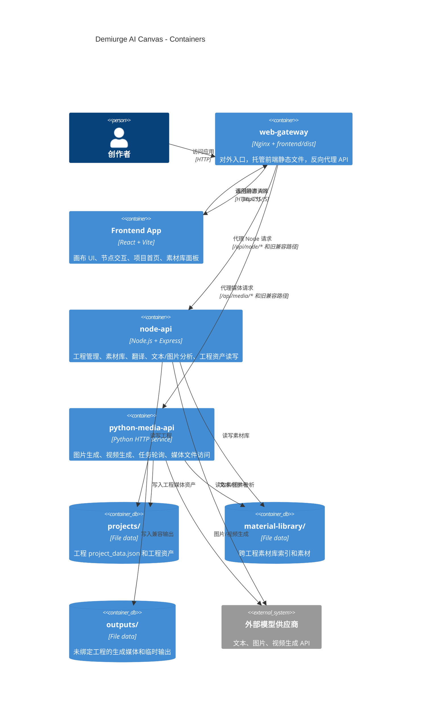
```mermaid
C4Container
  title Demiurge AI Canvas - Containers

  Person(creator, "创作者")

  Container(web, "web-gateway", "Nginx + frontend/dist", "对外入口，托管前端静态文件，反向代理 API")
  Container(frontend, "Frontend App", "React + Vite", "画布 UI、节点交互、项目首页、素材库面板")
  Container(nodeApi, "node-api", "Node.js + Express", "工程管理、素材库、翻译、文本/图片分析、工程资产读写")
  Container(pyApi, "python-media-api", "Python HTTP service", "图片生成、视频生成、任务轮询、媒体文件访问")

  ContainerDb(projects, "projects/", "File data", "工程 project_data.json 和工程资产")
  ContainerDb(materials, "material-library/", "File data", "跨工程素材库索引和素材")
  ContainerDb(outputs, "outputs/", "File data", "未绑定工程的生成媒体和临时输出")

  System_Ext(modelProviders, "外部模型供应商", "文本、图片、视频生成 API")

  Rel(creator, web, "访问应用", "HTTP")
  Rel(web, frontend, "返回静态资源", "HTML/CSS/JS")
  Rel(frontend, web, "调用同源 API", "/api/*")
  Rel(web, nodeApi, "代理 Node 请求", "/api/node/* 和旧兼容路径")
  Rel(web, pyApi, "代理媒体请求", "/api/media/* 和旧兼容路径")
  Rel(nodeApi, projects, "读写工程")
  Rel(nodeApi, materials, "读写素材库")
  Rel(pyApi, projects, "写入工程媒体资产")
  Rel(pyApi, materials, "读取素材参考")
  Rel(pyApi, outputs, "写入兼容输出")
  Rel(nodeApi, modelProviders, "文本/图片分析")
  Rel(pyApi, modelProviders, "图片/视频生成")
```

### C4-3 组件图

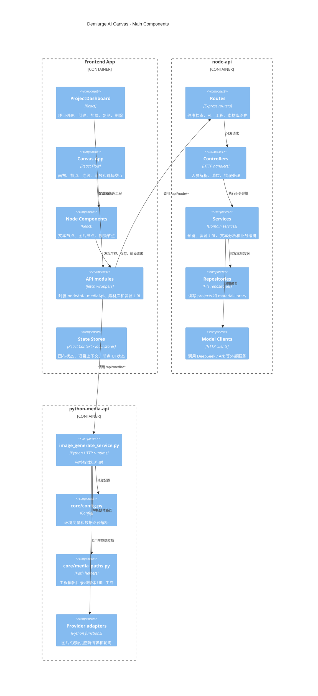
```mermaid
C4Component
  title Demiurge AI Canvas - Main Components

  Container_Boundary(frontendBoundary, "Frontend App") {
    Component(projectDashboard, "ProjectDashboard", "React", "项目列表、创建、加载、复制、删除")
    Component(canvasApp, "Canvas App", "React Flow", "画布、节点、连线、缩放和选择交互")
    Component(nodeComponents, "Node Components", "React", "文本节点、图片节点、视频节点")
    Component(frontendApi, "API modules", "fetch wrappers", "封装 nodeApi、mediaApi、素材库和资源 URL")
    Component(frontendStore, "State Stores", "React Context / local stores", "画布状态、项目上下文、节点 UI 状态")
  }

  Container_Boundary(nodeBoundary, "node-api") {
    Component(nodeRoutes, "Routes", "Express routers", "健康检查、AI、工程、素材库路由")
    Component(nodeControllers, "Controllers", "HTTP handlers", "入参解析、响应、错误处理")
    Component(nodeServices, "Services", "Domain services", "预览、资源 URL、文本分析和业务编排")
    Component(nodeRepositories, "Repositories", "File repositories", "读写 projects 和 material-library")
    Component(nodeClients, "Model Clients", "HTTP clients", "调用 DeepSeek / Ark 等外部服务")
  }

  Container_Boundary(pyBoundary, "python-media-api") {
    Component(mediaRuntime, "image_generate_service.py", "Python HTTP runtime", "完整媒体运行时")
    Component(mediaConfig, "core/config.py", "Config", "环境变量和数据路径解析")
    Component(mediaPaths, "core/media_paths.py", "Path helpers", "工程输出目录和媒体 URL 生成")
    Component(mediaProviders, "Provider adapters", "Python functions", "图片/视频供应商请求和轮询")
  }

  Rel(projectDashboard, frontendApi, "加载和管理工程")
  Rel(canvasApp, nodeComponents, "渲染节点")
  Rel(nodeComponents, frontendApi, "发起生成、保存、翻译请求")
  Rel(frontendApi, nodeRoutes, "调用 /api/node/*")
  Rel(frontendApi, mediaRuntime, "调用 /api/media/*")
  Rel(nodeRoutes, nodeControllers, "分发请求")
  Rel(nodeControllers, nodeServices, "执行业务逻辑")
  Rel(nodeServices, nodeRepositories, "读写本地数据")
  Rel(nodeServices, nodeClients, "调用模型")
  Rel(mediaRuntime, mediaConfig, "读取配置")
  Rel(mediaRuntime, mediaPaths, "解析媒体路径")
  Rel(mediaRuntime, mediaProviders, "调用生成供应商")
```

### 数据流图

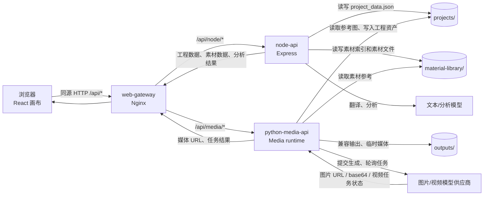
```mermaid
flowchart LR
  Browser["浏览器\nReact 画布"] -->|同源 HTTP /api/*| Gateway["web-gateway\nNginx"]

  Gateway -->|/api/node/*| NodeApi["node-api\nExpress"]
  Gateway -->|/api/media/*| MediaApi["python-media-api\nMedia runtime"]

  NodeApi -->|读写 project_data.json| Projects[("projects/")]
  NodeApi -->|读写素材索引和素材文件| MaterialLibrary[("material-library/")]
  NodeApi -->|翻译、分析| TextProviders["文本/分析模型"]

  MediaApi -->|读取参考图、写入工程资产| Projects
  MediaApi -->|读取素材参考| MaterialLibrary
  MediaApi -->|兼容输出、临时媒体| Outputs[("outputs/")]
  MediaApi -->|提交生成、轮询任务| MediaProviders["图片/视频模型供应商"]

  MediaProviders -->|图片 URL / base64 / 视频任务状态| MediaApi
  MediaApi -->|媒体 URL、任务结果| Gateway
  NodeApi -->|工程数据、素材数据、分析结果| Gateway
  Gateway --> Browser
```

### 大模型能力地图

当前项目把模型能力分成三类：文本/分析、图片生成、视频生成。前端节点只负责选择模型和组织参数，真正的模型调用发生在后端，避免 API Key 暴露到浏览器。

| 能力类型 | 前端节点/入口 | UI 模型或功能名 | 实际模型/供应商 | 后端服务 | 作用环节 |
| --- | --- | --- | --- | --- | --- |
| 翻译 | 文本节点、图片节点、视频节点的翻译按钮 | DeepSeek | `deepseek-chat` | `node-api` | 将中文提示词翻译成适合绘画/视频生成的英文，或将英文翻译成中文 |
| 文本/图文分析 | 文本节点分析能力 | Seed-2.0-lite | `doubao-seed-2-0-lite-260215` via Ark | `node-api` | 对文本和最多 4 张图片做中文结构化分析 |
| 文本/图文分析备用 | 文本节点分析能力 | DeepSeek fallback | `DEEPSEEK_ANALYSIS_MODEL`，默认 `deepseek-chat` | `node-api` | 当用户选择非 Seed-2.0-lite 分析模型时，用 DeepSeek 执行分析 |
| 图片生成 | 图片节点 | Seedream-5.0 | `doubao-seedream-5-0-260128` via Volcengine Ark | `python-media-api` | 根据提示词、比例、尺寸和参考图生成图片 |
| 图片生成 | 图片节点 | Nano Banana 2 | `gemini-3.1-flash-image-preview` via VectorEngine OpenAI-compatible API | `python-media-api` | 使用 Gemini 图像模型能力生成图片 |
| 图片生成 | 图片节点 | Nano banana pro | `gemini-3-pro-image-preview` via VectorEngine OpenAI-compatible API | `python-media-api` | 默认图片生成模型，用于更高质量图片生成 |
| 图片生成/编辑 | 图片节点 | GPT Image 2 | `gpt-image-2` via OpenAI Images-compatible API | `python-media-api` | 支持纯文本生图，也支持带输入图的图片编辑/生成 |
| 视频生成 | 视频节点 | Wan 2.7 I2V | `wan2.7-i2v` via DashScope | `python-media-api` | 图片转视频，要求参考图，提交异步视频任务 |
| 视频生成 | 视频节点 | Seedance 2.0 | `seed-2` / 环境变量分辨率映射 via Xunke | `python-media-api` | 文生视频或图生视频，支持多参考图 |
| 视频生成 | 视频节点 | Seedance 2.0 Fast | `seed-2-fast` / 环境变量分辨率映射 via Xunke | `python-media-api` | 更快的视频生成通道，支持文生视频或图生视频 |
| 视频生成备用 | 视频节点 | Seedance Ark fallback | `doubao-seedance-2-0-260128`、`doubao-seedance-1-5-pro-251215` via Ark | `python-media-api` | 当视频 provider 配置为 Ark 时提交 Seedance 视频任务 |
| 主体/人脸审核 | 图片节点、素材库、视频节点前置检查 | Seedance face review | Xunke Seedance 审核接口 | `python-media-api` | 在图片作为 Seedance 参考前做主体/人脸审核，避免视频生成阶段失败 |

模型配置主要分布在：

- `frontend/src/features/generation/imageGenerationConfig.js`：图片节点可选模型、比例、尺寸和 UI 默认值。
- `frontend/src/features/generation/videoGenerationConfig.js`：视频节点可选模型、分辨率、时长和参考图约束。
- `backend/node/src/services/aiService.js`：DeepSeek 翻译、Seed/DeepSeek 分析。
- `backend/python/app/image_generate_service.py`：图片/视频模型路由、供应商调用、任务轮询和媒体保存。

### 模型调用关系图

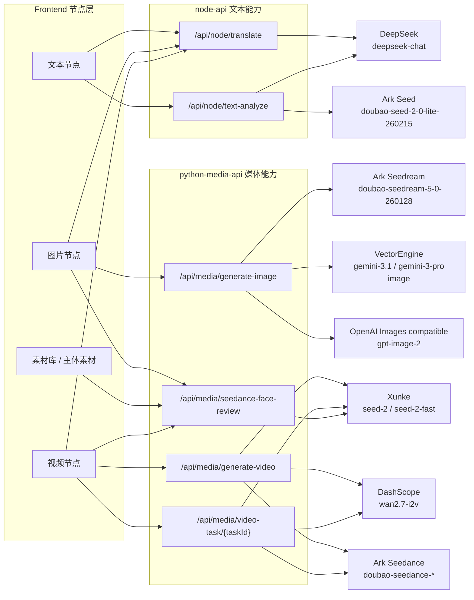
```mermaid
flowchart LR
  subgraph Frontend["Frontend 节点层"]
    TextNode["文本节点"]
    ImageNode["图片节点"]
    VideoNode["视频节点"]
    MaterialPanel["素材库 / 主体素材"]
  end

  subgraph NodeApi["node-api 文本能力"]
    Translate["/api/node/translate"]
    Analyze["/api/node/text-analyze"]
  end

  subgraph MediaApi["python-media-api 媒体能力"]
    ImageGen["/api/media/generate-image"]
    VideoGen["/api/media/generate-video"]
    VideoTask["/api/media/video-task/{taskId}"]
    FaceReview["/api/media/seedance-face-review"]
  end

  DeepSeek["DeepSeek\ndeepseek-chat"]
  SeedLite["Ark Seed\n doubao-seed-2-0-lite-260215"]
  Seedream["Ark Seedream\n doubao-seedream-5-0-260128"]
  VectorEngine["VectorEngine\n gemini-3.1 / gemini-3-pro image"]
  GPTImage["OpenAI Images compatible\n gpt-image-2"]
  DashScope["DashScope\n wan2.7-i2v"]
  Xunke["Xunke\n seed-2 / seed-2-fast"]
  ArkVideo["Ark Seedance\n doubao-seedance-*"]

  TextNode --> Translate --> DeepSeek
  TextNode --> Analyze --> SeedLite
  Analyze --> DeepSeek

  ImageNode --> Translate
  ImageNode --> ImageGen
  ImageGen --> Seedream
  ImageGen --> VectorEngine
  ImageGen --> GPTImage

  VideoNode --> Translate
  VideoNode --> VideoGen
  VideoNode --> VideoTask
  VideoGen --> DashScope
  VideoGen --> Xunke
  VideoGen --> ArkVideo
  VideoTask --> DashScope
  VideoTask --> Xunke
  VideoTask --> ArkVideo

  ImageNode --> FaceReview --> Xunke
  MaterialPanel --> FaceReview
  VideoNode --> FaceReview
```

### 模型时序图：文本翻译与分析

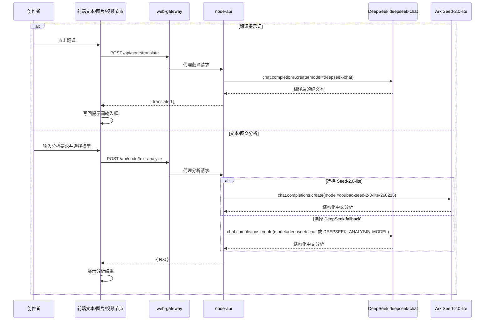
```mermaid
sequenceDiagram
  participant U as 创作者
  participant Node as 前端文本/图片/视频节点
  participant G as web-gateway
  participant N as node-api
  participant DeepSeek as DeepSeek deepseek-chat
  participant ArkSeed as Ark Seed-2.0-lite

  alt 翻译提示词
    U->>Node: 点击翻译
    Node->>G: POST /api/node/translate
    G->>N: 代理翻译请求
    N->>DeepSeek: chat.completions.create(model=deepseek-chat)
    DeepSeek-->>N: 翻译后的纯文本
    N-->>Node: { translated }
    Node->>Node: 写回提示词输入框
  else 文本/图文分析
    U->>Node: 输入分析要求并选择模型
    Node->>G: POST /api/node/text-analyze
    G->>N: 代理分析请求
    alt 选择 Seed-2.0-lite
      N->>ArkSeed: chat.completions.create(model=doubao-seed-2-0-lite-260215)
      ArkSeed-->>N: 结构化中文分析
    else 选择 DeepSeek fallback
      N->>DeepSeek: chat.completions.create(model=deepseek-chat 或 DEEPSEEK_ANALYSIS_MODEL)
      DeepSeek-->>N: 结构化中文分析
    end
    N-->>Node: { text }
    Node->>Node: 展示分析结果
  end
```

### 模型时序图：图片节点生成

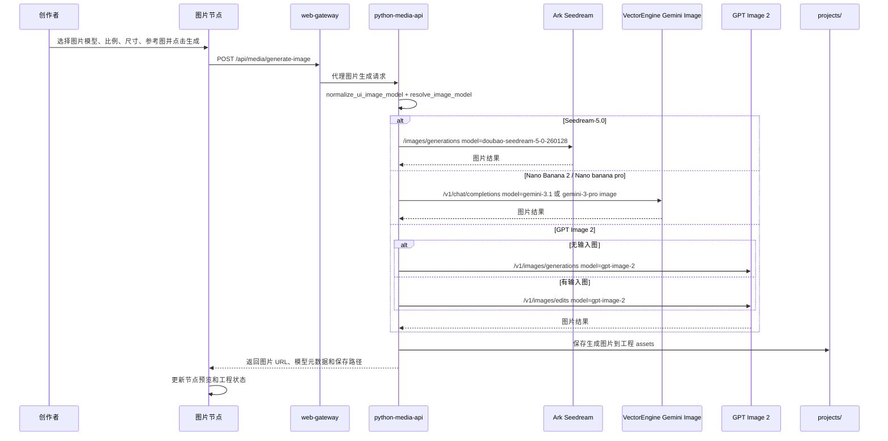
```mermaid
sequenceDiagram
  participant U as 创作者
  participant Img as 图片节点
  participant G as web-gateway
  participant M as python-media-api
  participant Ark as Ark Seedream
  participant VE as VectorEngine Gemini Image
  participant GPT as GPT Image 2
  participant P as projects/

  U->>Img: 选择图片模型、比例、尺寸、参考图并点击生成
  Img->>G: POST /api/media/generate-image
  G->>M: 代理图片生成请求
  M->>M: normalize_ui_image_model + resolve_image_model
  alt Seedream-5.0
    M->>Ark: /images/generations model=doubao-seedream-5-0-260128
    Ark-->>M: 图片结果
  else Nano Banana 2 / Nano banana pro
    M->>VE: /v1/chat/completions model=gemini-3.1 或 gemini-3-pro image
    VE-->>M: 图片结果
  else GPT Image 2
    alt 无输入图
      M->>GPT: /v1/images/generations model=gpt-image-2
    else 有输入图
      M->>GPT: /v1/images/edits model=gpt-image-2
    end
    GPT-->>M: 图片结果
  end
  M->>P: 保存生成图片到工程 assets
  M-->>Img: 返回图片 URL、模型元数据和保存路径
  Img->>Img: 更新节点预览和工程状态
```

### 模型时序图：视频节点生成与轮询

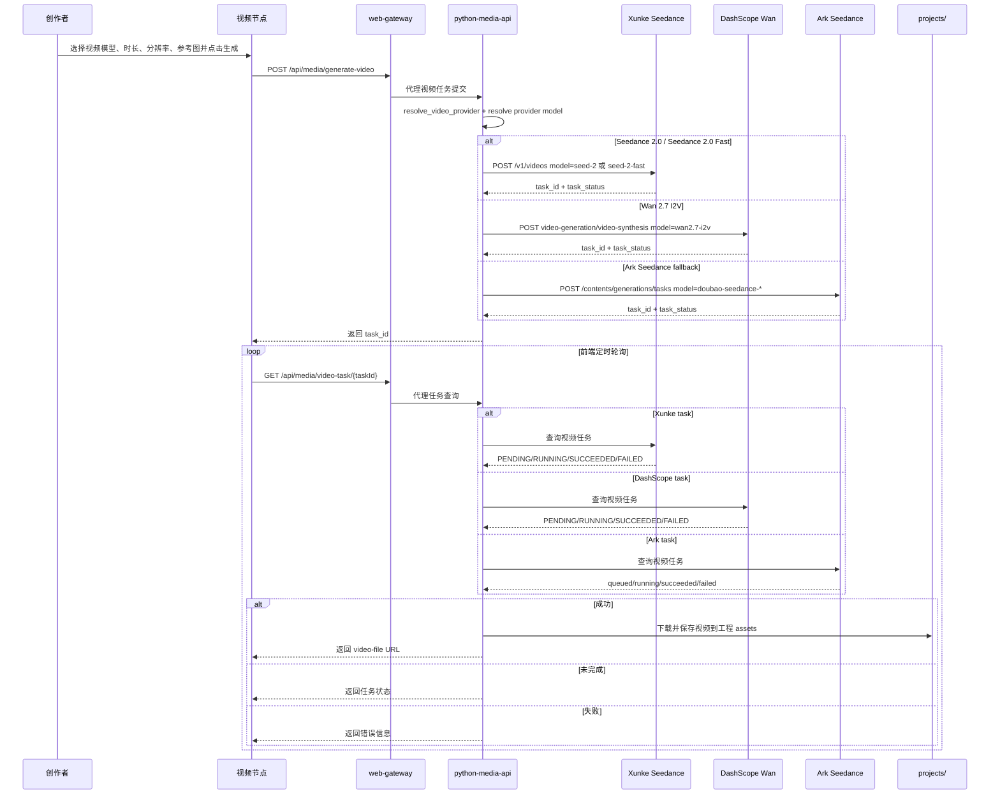
```mermaid
sequenceDiagram
  participant U as 创作者
  participant Vid as 视频节点
  participant G as web-gateway
  participant M as python-media-api
  participant Xunke as Xunke Seedance
  participant Dash as DashScope Wan
  participant Ark as Ark Seedance
  participant P as projects/

  U->>Vid: 选择视频模型、时长、分辨率、参考图并点击生成
  Vid->>G: POST /api/media/generate-video
  G->>M: 代理视频任务提交
  M->>M: resolve_video_provider + resolve provider model

  alt Seedance 2.0 / Seedance 2.0 Fast
    M->>Xunke: POST /v1/videos model=seed-2 或 seed-2-fast
    Xunke-->>M: task_id + task_status
  else Wan 2.7 I2V
    M->>Dash: POST video-generation/video-synthesis model=wan2.7-i2v
    Dash-->>M: task_id + task_status
  else Ark Seedance fallback
    M->>Ark: POST /contents/generations/tasks model=doubao-seedance-*
    Ark-->>M: task_id + task_status
  end

  M-->>Vid: 返回 task_id

  loop 前端定时轮询
    Vid->>G: GET /api/media/video-task/{taskId}
    G->>M: 代理任务查询
    alt Xunke task
      M->>Xunke: 查询视频任务
      Xunke-->>M: PENDING/RUNNING/SUCCEEDED/FAILED
    else DashScope task
      M->>Dash: 查询视频任务
      Dash-->>M: PENDING/RUNNING/SUCCEEDED/FAILED
    else Ark task
      M->>Ark: 查询视频任务
      Ark-->>M: queued/running/succeeded/failed
    end
    alt 成功
      M->>P: 下载并保存视频到工程 assets
      M-->>Vid: 返回 video-file URL
    else 未完成
      M-->>Vid: 返回任务状态
    else 失败
      M-->>Vid: 返回错误信息
    end
  end
```

### 关键业务时序图：打开并保存工程

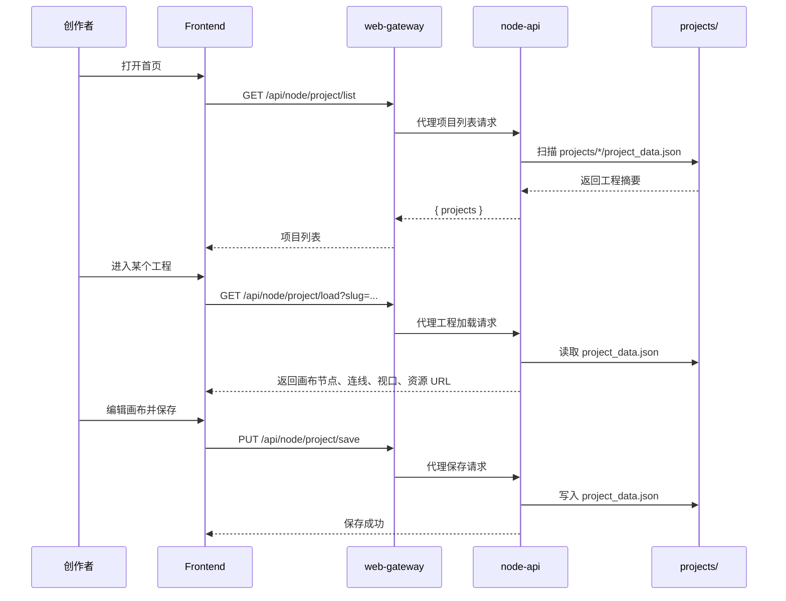
```mermaid
sequenceDiagram
  participant U as 创作者
  participant F as Frontend
  participant G as web-gateway
  participant N as node-api
  participant P as projects/

  U->>F: 打开首页
  F->>G: GET /api/node/project/list
  G->>N: 代理项目列表请求
  N->>P: 扫描 projects/*/project_data.json
  P-->>N: 返回工程摘要
  N-->>G: { projects }
  G-->>F: 项目列表
  U->>F: 进入某个工程
  F->>G: GET /api/node/project/load?slug=...
  G->>N: 代理工程加载请求
  N->>P: 读取 project_data.json
  N-->>F: 返回画布节点、连线、视口、资源 URL
  U->>F: 编辑画布并保存
  F->>G: PUT /api/node/project/save
  G->>N: 代理保存请求
  N->>P: 写入 project_data.json
  N-->>F: 保存成功
```

### 关键业务时序图：图片生成

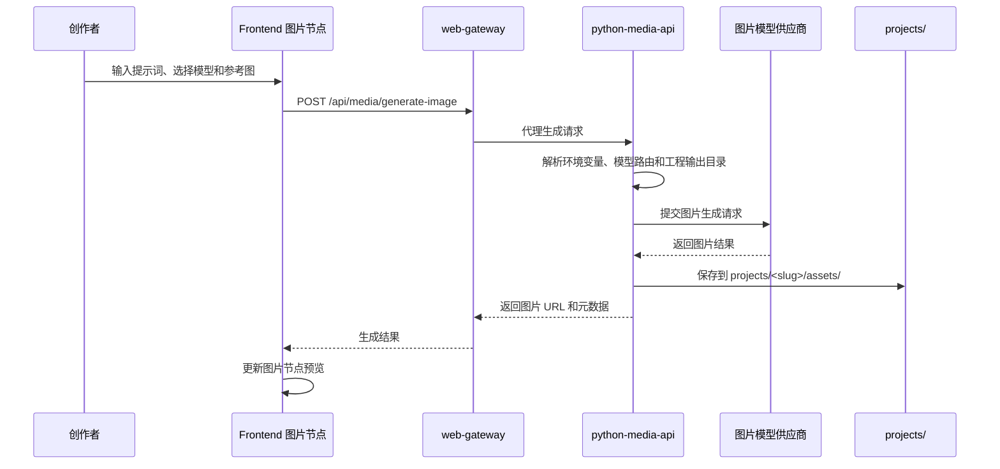
```mermaid
sequenceDiagram
  participant U as 创作者
  participant F as Frontend 图片节点
  participant G as web-gateway
  participant M as python-media-api
  participant Provider as 图片模型供应商
  participant P as projects/

  U->>F: 输入提示词、选择模型和参考图
  F->>G: POST /api/media/generate-image
  G->>M: 代理生成请求
  M->>M: 解析环境变量、模型路由和工程输出目录
  M->>Provider: 提交图片生成请求
  Provider-->>M: 返回图片结果
  M->>P: 保存到 projects/<slug>/assets/
  M-->>G: 返回图片 URL 和元数据
  G-->>F: 生成结果
  F->>F: 更新图片节点预览
```

### 关键业务时序图：视频生成与轮询

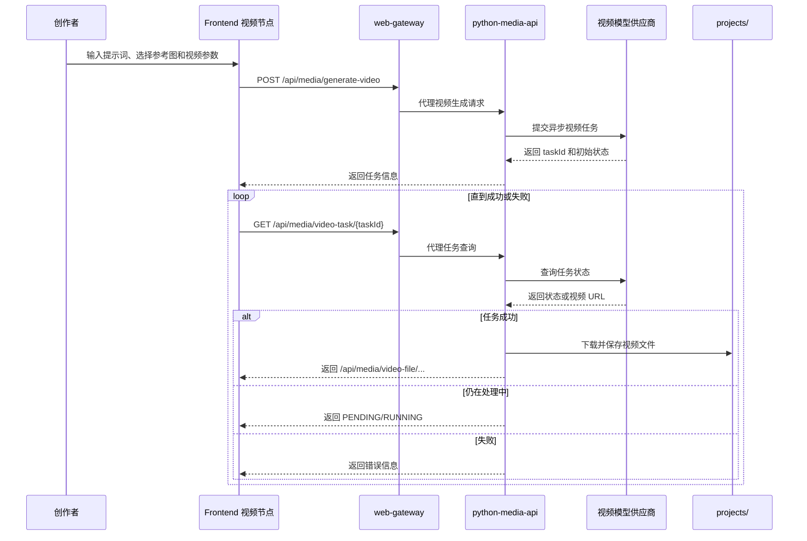
```mermaid
sequenceDiagram
  participant U as 创作者
  participant F as Frontend 视频节点
  participant G as web-gateway
  participant M as python-media-api
  participant Provider as 视频模型供应商
  participant P as projects/

  U->>F: 输入提示词、选择参考图和视频参数
  F->>G: POST /api/media/generate-video
  G->>M: 代理视频生成请求
  M->>Provider: 提交异步视频任务
  Provider-->>M: 返回 taskId 和初始状态
  M-->>F: 返回任务信息

  loop 直到成功或失败
    F->>G: GET /api/media/video-task/{taskId}
    G->>M: 代理任务查询
    M->>Provider: 查询任务状态
    Provider-->>M: 返回状态或视频 URL
    alt 任务成功
      M->>P: 下载并保存视频文件
      M-->>F: 返回 /api/media/video-file/...
    else 仍在处理中
      M-->>F: 返回 PENDING/RUNNING
    else 失败
      M-->>F: 返回错误信息
    end
  end
```

### 核心实体状态图：工程

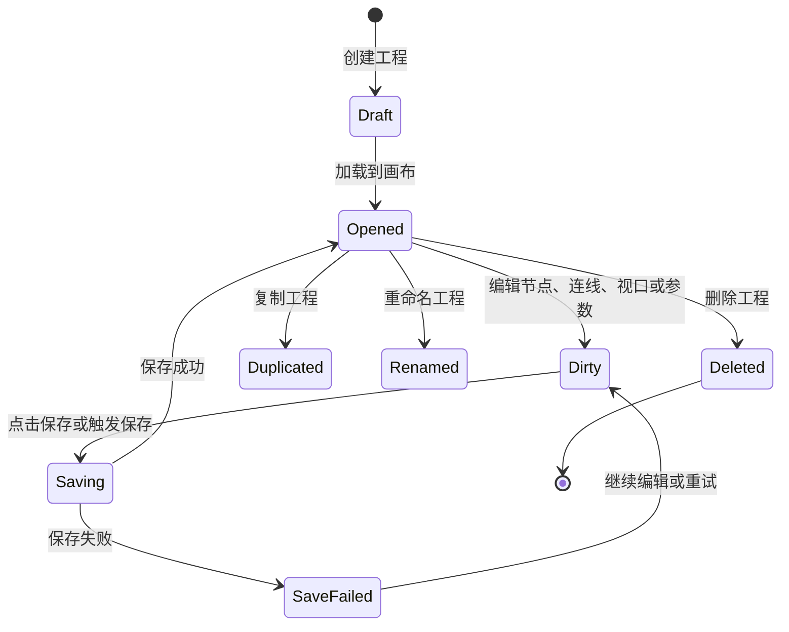
```mermaid
stateDiagram-v2
  [*] --> Draft: 创建工程
  Draft --> Opened: 加载到画布
  Opened --> Dirty: 编辑节点、连线、视口或参数
  Dirty --> Saving: 点击保存或触发保存
  Saving --> Opened: 保存成功
  Saving --> SaveFailed: 保存失败
  SaveFailed --> Dirty: 继续编辑或重试
  Opened --> Duplicated: 复制工程
  Opened --> Renamed: 重命名工程
  Opened --> Deleted: 删除工程
  Deleted --> [*]
```

### 核心实体状态图：生成任务

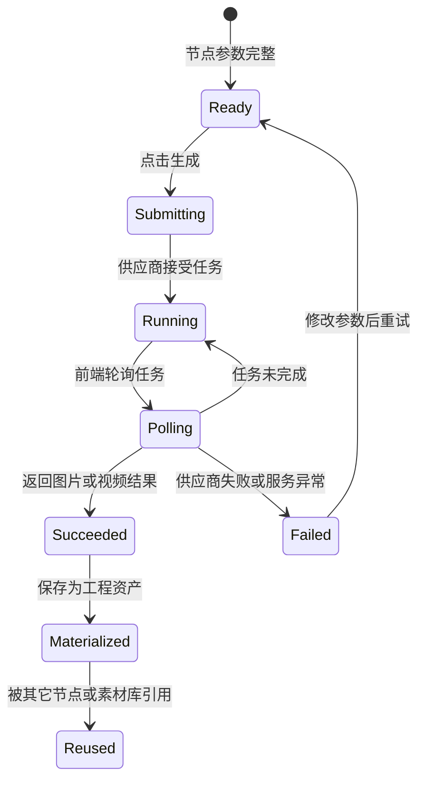
```mermaid
stateDiagram-v2
  [*] --> Ready: 节点参数完整
  Ready --> Submitting: 点击生成
  Submitting --> Running: 供应商接受任务
  Running --> Polling: 前端轮询任务
  Polling --> Running: 任务未完成
  Polling --> Succeeded: 返回图片或视频结果
  Polling --> Failed: 供应商失败或服务异常
  Succeeded --> Materialized: 保存为工程资产
  Materialized --> Reused: 被其它节点或素材库引用
  Failed --> Ready: 修改参数后重试
```

### 核心实体状态图：素材

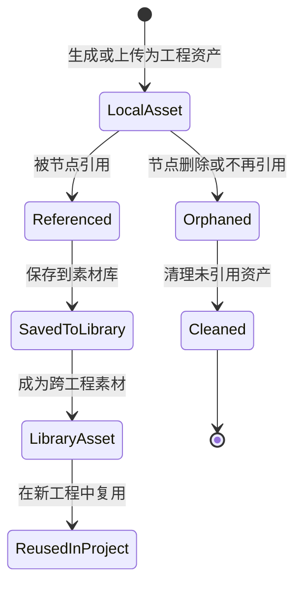
```mermaid
stateDiagram-v2
  [*] --> LocalAsset: 生成或上传为工程资产
  LocalAsset --> Referenced: 被节点引用
  Referenced --> SavedToLibrary: 保存到素材库
  SavedToLibrary --> LibraryAsset: 成为跨工程素材
  LibraryAsset --> ReusedInProject: 在新工程中复用
  LocalAsset --> Orphaned: 节点删除或不再引用
  Orphaned --> Cleaned: 清理未引用资产
  Cleaned --> [*]
```

## 本地启动顺序

本地开发时请按下面顺序启动，三个服务分别在三个终端中运行。

### 1. 启动 Node API 服务

```powershell
cd backend\node
npm install
npm run dev
```

服务地址：

- `http://127.0.0.1:3200`
- 健康检查：`http://127.0.0.1:3200/api/node/health`

Node 服务负责工程管理、素材库、翻译、文本/图片分析、工程资产读写。

### 2. 启动 Python Media API 服务

```powershell
cd backend\python
pip install -r requirements.txt
node run-image-service-dev.mjs
```

服务地址：

- `http://127.0.0.1:3300`
- 健康检查：`http://127.0.0.1:3300/api/media/health`

Python 服务负责图片生成、视频生成、视频任务轮询、媒体文件访问和媒体处理。

### 3. 启动前端

```powershell
cd frontend
npm install
npm run dev
```

打开：

- `http://127.0.0.1:3100`

前端只负责 UI、路由、组件、状态、hooks 和前端 API 封装。

## 目录结构

```text
demiurge-ai-canvas/
  frontend/                  前端 React/Vite 项目
    package.json
    .env.example
    src/
      api/                   前端 API 封装、资源 URL 规范化
      components/            通用 UI 组件、面板、工具栏
      features/              业务功能模块
        generation/          图片/视频生成模型配置
        nodes/               React Flow 节点实现
        projects/            项目首页
      hooks/                 前端 hooks 预留目录
      router/                前端路由预留目录
      store/                 前端状态和 Context
      styles/                全局样式
      utils/                 前端工具函数

  backend/
    node/                    Node API 服务
      package.json
      .env.example
      src/
        main.js              Express 入口
        routes/              路由注册
        controllers/         HTTP 入参/出参
        services/            业务流程和派生数据
        repositories/        本地文件/索引读写
        clients/             外部模型供应商客户端
        config/              环境变量、路径、存储配置
        utils/               HTTP、媒体响应等工具

    python/                  Python Media API 服务
      requirements.txt
      .env.example
      app/
        image_generate_service.py  当前完整媒体运行时
        main.py                   FastAPI 壳入口
        core/                     配置、路径、基础设施
        routers/                  路由预留目录
        schemas/                  请求/响应结构预留目录
        services/                 媒体业务服务预留目录
        repositories/             文件读写预留目录
        models/                   模型对象预留目录
        utils/                    工具函数预留目录

  docs/                      架构、开发、阶段基线文档
  projects/                  本地工程数据
  outputs/                   未绑定工程的生成输出
  material-library/          跨工程素材库
  tools/                     本地工具和二进制依赖
  README.md
  AGENT.md
  .gitignore
```

根目录不保留业务运行脚本，也不保留根 `package.json`。每个项目独立管理自己的依赖、环境变量和启动命令。

## 架构图

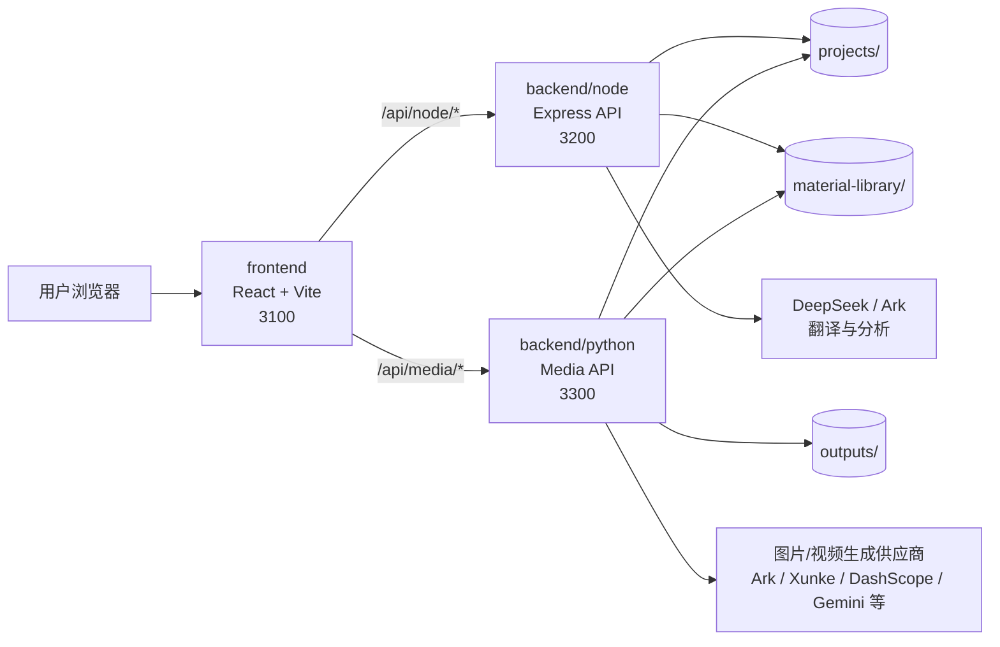
```mermaid
flowchart LR
  User["用户浏览器"] --> Frontend["frontend<br/>React + Vite<br/>3100"]

  Frontend -->|"/api/node/*"| NodeApi["backend/node<br/>Express API<br/>3200"]
  Frontend -->|"/api/media/*"| PythonApi["backend/python<br/>Media API<br/>3300"]

  NodeApi --> Projects[("projects/")]
  NodeApi --> MaterialLibrary[("material-library/")]
  NodeApi --> ModelText["DeepSeek / Ark<br/>翻译与分析"]

  PythonApi --> Projects
  PythonApi --> Outputs[("outputs/")]
  PythonApi --> MaterialLibrary
  PythonApi --> MediaProviders["图片/视频生成供应商<br/>Ark / Xunke / DashScope / Gemini 等"]
```

## 请求时序图

### 项目打开时序

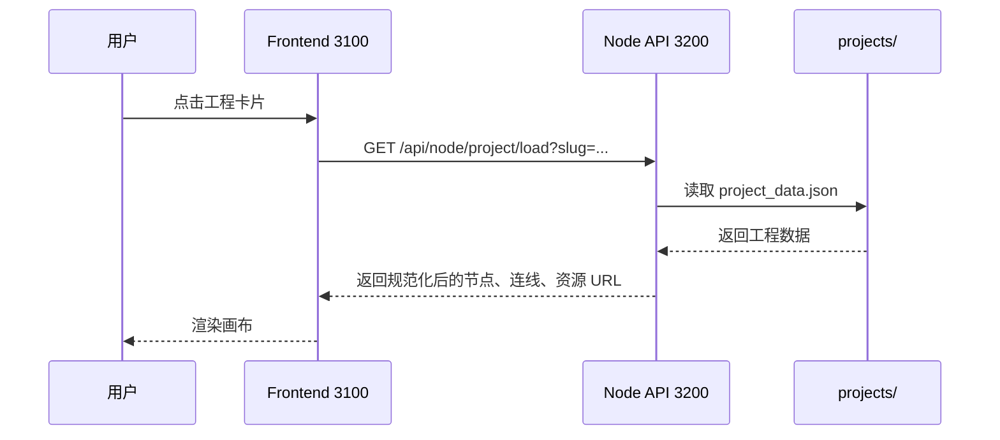
```mermaid
sequenceDiagram
  participant U as 用户
  participant F as Frontend 3100
  participant N as Node API 3200
  participant P as projects/

  U->>F: 点击工程卡片
  F->>N: GET /api/node/project/load?slug=...
  N->>P: 读取 project_data.json
  P-->>N: 返回工程数据
  N-->>F: 返回规范化后的节点、连线、资源 URL
  F-->>U: 渲染画布
```

### 图片生成时序

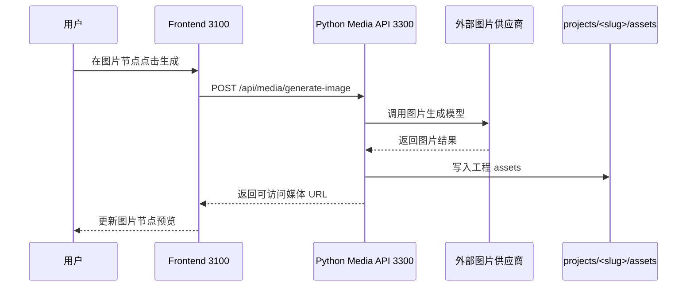
```mermaid
sequenceDiagram
  participant U as 用户
  participant F as Frontend 3100
  participant M as Python Media API 3300
  participant Provider as 外部图片供应商
  participant P as projects/<slug>/assets

  U->>F: 在图片节点点击生成
  F->>M: POST /api/media/generate-image
  M->>Provider: 调用图片生成模型
  Provider-->>M: 返回图片结果
  M->>P: 写入工程 assets
  M-->>F: 返回可访问媒体 URL
  F-->>U: 更新图片节点预览
```

### 视频生成时序

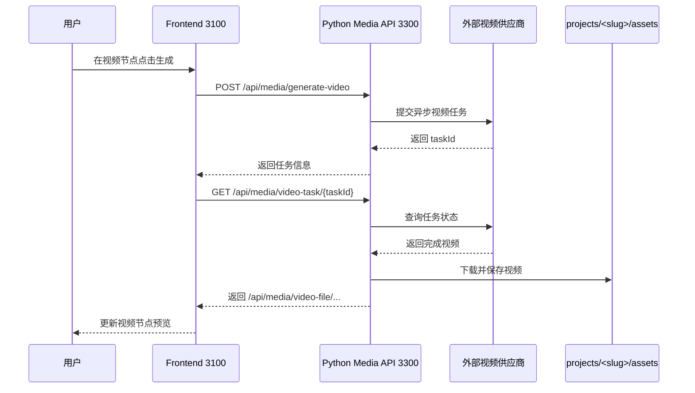
```mermaid
sequenceDiagram
  participant U as 用户
  participant F as Frontend 3100
  participant M as Python Media API 3300
  participant Provider as 外部视频供应商
  participant P as projects/<slug>/assets

  U->>F: 在视频节点点击生成
  F->>M: POST /api/media/generate-video
  M->>Provider: 提交异步视频任务
  Provider-->>M: 返回 taskId
  M-->>F: 返回任务信息
  F->>M: GET /api/media/video-task/{taskId}
  M->>Provider: 查询任务状态
  Provider-->>M: 返回完成视频
  M->>P: 下载并保存视频
  M-->>F: 返回 /api/media/video-file/...
  F-->>U: 更新视频节点预览
```

## API 命名空间

前端业务请求统一使用命名空间：

- `/api/node/*` 转发到 Node API 服务。
- `/api/media/*` 转发到 Python Media API 服务。

本地开发由 `frontend/vite.config.js` 配置代理：

```text
/api/node  -> http://127.0.0.1:3200
/api/media -> http://127.0.0.1:3300
```

为了兼容旧工程数据，当前仍保留这些旧路径：

- `/api/project/*`
- `/api/material-library/*`
- `/api/video-file/*`
- `/api/generate-image`
- `/api/generate-video`
- `/api/video-task/*`
- `/api/seedance-face-review`

旧路径用于读取历史工程、历史素材和历史视频，不建议新代码继续直接使用。

## 环境变量

每个服务维护自己的环境变量文件：

```text
frontend/.env.example
backend/node/.env.example
backend/python/.env.example
```

本地开发时复制为 `.env.local`：

```powershell
Copy-Item frontend\.env.example frontend\.env.local
Copy-Item backend\node\.env.example backend\node\.env.local
Copy-Item backend\python\.env.example backend\python\.env.local
```

不要把 `.env.local`、API Key、用户本地数据提交到仓库。

## 本地数据目录

```text
projects/<slug>/project_data.json
projects/<slug>/assets/
```

保存工程画布、节点、连线、视口和工程专属资产。

```text
material-library/library_data.json
material-library/seedance_subjects.json
material-library/assets/
```

保存跨工程素材库和 Seedance 主体数据。

```text
outputs/
```

保存未绑定具体工程的生成媒体、临时文件或兼容输出。

除非明确需要清理数据，不要删除这些目录。

## Docker 部署

生产部署使用 Docker Compose，当前固定为三个容器服务：

| Compose 服务 | 容器角色 | 运行内容 | 对外暴露 |
| --- | --- | --- | --- |
| `web-gateway` | Nginx 网关容器 | `frontend/dist` 静态文件和 Nginx 反向代理配置 | 是 |
| `node-api` | Node 后端容器 | `backend/node/src` 源码和生产依赖 | 否，仅 Docker 内部访问 |
| `python-media-api` | Python 媒体后端容器 | `backend/python/app` 源码和 Python 依赖 | 否，仅 Docker 内部访问 |

`web-gateway` 不是 Vite 开发服务，也不是单独的前端 Node 进程。前端在镜像构建阶段执行 `npm run build`，生成的 `dist` 被复制到 Nginx 镜像中，运行时由 Nginx 直接托管。浏览器只访问 `web-gateway` 暴露的统一地址，API 请求由 Nginx 转发到内部后端容器，因此不会产生浏览器跨域问题。

### Dockerfile 位置

```text
frontend/Dockerfile          构建 web-gateway 镜像：Node 构建 dist，Nginx 托管静态文件
backend/node/Dockerfile      构建 node-api 镜像：运行 Node API
backend/python/Dockerfile    构建 python-media-api 镜像：运行 Python Media API
docker-compose.yml           编排三个容器、端口、环境变量和数据卷
```

基础镜像默认从 `docker.m.daocloud.io/library` 拉取，避免直接访问 Docker Hub。前端和 Node 依赖安装默认使用 npm 国内镜像源 `https://mirrors.huaweicloud.com/repository/npm/`，并通过 npm 的 `replace-registry-host=always` 覆盖 lock 文件里记录的旧下载域名。Python 依赖安装使用 pip 国内镜像源 `https://pypi.tuna.tsinghua.edu.cn/simple`，Python 镜像内的 apt 源也会切到清华 Debian 镜像，减少外网依赖卡住的概率。

### 端口说明

默认部署目标服务器为 `root@192.168.10.113`，部署目录为 `/opt/demiurge-ai-canvas`。

| 位置 | 端口 | 用途 | 说明 |
| --- | --- | --- | --- |
| 宿主机 | `80` | 对外 Web 入口 | 默认映射到 `web-gateway:80` |
| 宿主机 | 自定义 `-PublicPort` | 对外 Web 入口 | 当 `80` 被其它服务占用时使用，例如 `8080` |
| Docker 内部 | `web-gateway:80` | Nginx 静态资源和反向代理 | 浏览器访问的唯一入口 |
| Docker 内部 | `node-api:3200` | Node API | 不映射到宿主机 |
| Docker 内部 | `python-media-api:3300` | Python Media API | 不映射到宿主机 |

部署脚本会在启动前检查目标公开端口。如果端口被服务器上其它服务占用，脚本会立即停止并提示更换 `-PublicPort`，不会停止、删除或重启其它服务。如果端口已经被本项目现有 `web-gateway` 使用，说明是正常迭代部署，脚本会继续。

Nginx 代理规则：

```text
/                         -> frontend/dist
/api/node/*               -> node-api:3200
/api/media/*              -> python-media-api:3300
/api/project/*            -> node-api:3200
/api/material-library/*   -> node-api:3200
/api/video-file/*         -> python-media-api:3300
/api/video-task/*         -> python-media-api:3300
/api/generate-image       -> python-media-api:3300
/api/generate-video       -> python-media-api:3300
/api/seedance-face-review -> python-media-api:3300
```

### 数据卷说明

服务器上的运行数据固定放在 `/opt/demiurge-ai-canvas/data` 下。后续迭代部署默认只更新代码和镜像，不覆盖这些数据。

| 宿主机路径 | 容器路径 | 使用服务 | 用途 | 默认部署是否覆盖 |
| --- | --- | --- | --- | --- |
| `/opt/demiurge-ai-canvas/data/projects` | `/app/projects` | `node-api`、`python-media-api` | 工程数据和工程资产 | 否 |
| `/opt/demiurge-ai-canvas/data/material-library` | `/app/material-library` | `node-api`、`python-media-api` | 跨工程素材库和索引 | 否 |
| `/opt/demiurge-ai-canvas/data/outputs` | `/app/outputs` | `python-media-api` | 未绑定工程的生成媒体和临时输出 | 否 |

容器内通过这些环境变量读取数据卷：

```text
PROJECTS_ROOT=/app/projects
MATERIAL_LIBRARY_ROOT=/app/material-library
OUTPUTS_ROOT=/app/outputs
```

首次部署或明确需要重新初始化数据时，才使用 `-InitData` 同步本地 `projects/`、`material-library/`、`outputs/` 到服务器数据目录。重新初始化前建议先备份服务器目录：

```powershell
ssh root@192.168.10.113 "cd /opt/demiurge-ai-canvas && tar -czf /root/demiurge-data-backup-$(date +%Y%m%d%H%M%S).tar.gz data"
```

### 一键部署

部署脚本面向 PowerShell 7.6.1：

```powershell
pwsh ./deploy/deploy.ps1 -InitData
```

这是首次部署命令，会同步本地数据。首次部署完成后，访问：

```text
http://192.168.10.113
http://192.168.10.113/api/node/health
http://192.168.10.113/api/media/health
```

后续功能开发完成后的迭代部署：

```powershell
pwsh ./deploy/deploy.ps1
```

这个命令默认不会同步或覆盖服务器数据卷。

如果服务器 `80` 端口已经被其它服务占用，换一个公开端口：

```powershell
pwsh ./deploy/deploy.ps1 -PublicPort 8080
```

访问地址相应变为 `http://192.168.10.113:8080`。

如果默认基础镜像源不可用，可以换一个镜像前缀：

```powershell
pwsh ./deploy/deploy.ps1 -DockerBaseRegistry docker.m.daocloud.io/library
```

如果默认 npm 源不可用，可以换一个 npm 镜像源：

```powershell
pwsh ./deploy/deploy.ps1 -NpmRegistry https://mirrors.cloud.tencent.com/npm/
```

常用运维命令：

```powershell
ssh root@192.168.10.113 "cd /opt/demiurge-ai-canvas && docker compose ps"
ssh root@192.168.10.113 "cd /opt/demiurge-ai-canvas && docker compose logs -f --tail=100"
ssh root@192.168.10.113 "cd /opt/demiurge-ai-canvas && docker compose restart"
```

这些命令只作用于 `/opt/demiurge-ai-canvas` 下的本项目 Compose 服务。

## 验证命令

前端构建：

```powershell
cd frontend
npm run build
```

Node 服务校验：

```powershell
cd backend\node
npm run verify
```

Python 语法检查：

```powershell
cd backend\python
python -m py_compile app\image_generate_service.py app\main.py app\core\config.py app\core\media_paths.py test_image_generate.py
```

最低功能验收：

- `http://127.0.0.1:3100` 能打开首页。
- Node 健康检查通过。
- Python Media 健康检查通过。
- 项目列表、创建、加载、保存、删除正常。
- 素材库列表、素材访问正常。
- 旧图片 `/api/project/media/...` 可读取。
- 旧视频 `/api/video-file/...` 可读取。
- 浏览器首页无 broken image，无控制台错误。

## 当前状态

当前仓库已经完成多项目、多服务工程化重构基线：

- 前端、Node 服务、Python 服务已拆分。
- 根目录不再承载业务启动脚本。
- Node 已形成 controller/service/repository/client/config 分层。
- Python 已开始拆出 core 基础设施，完整媒体运行时仍保持兼容。
- 前端已按 api/components/store/features/utils/styles 收口。
- 旧工程、旧素材、旧视频路径保持兼容。
