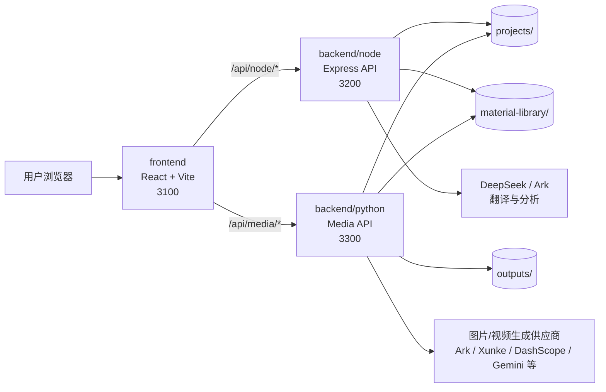
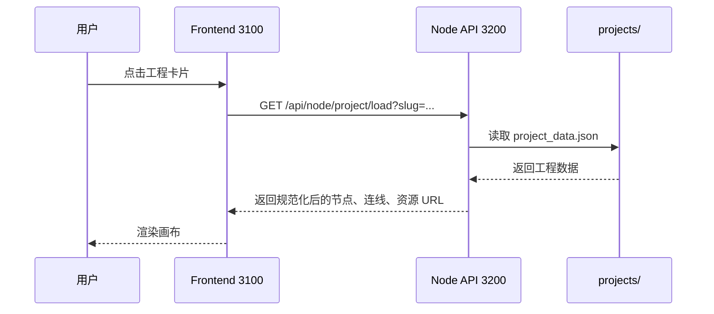
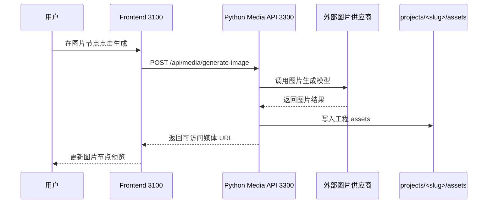
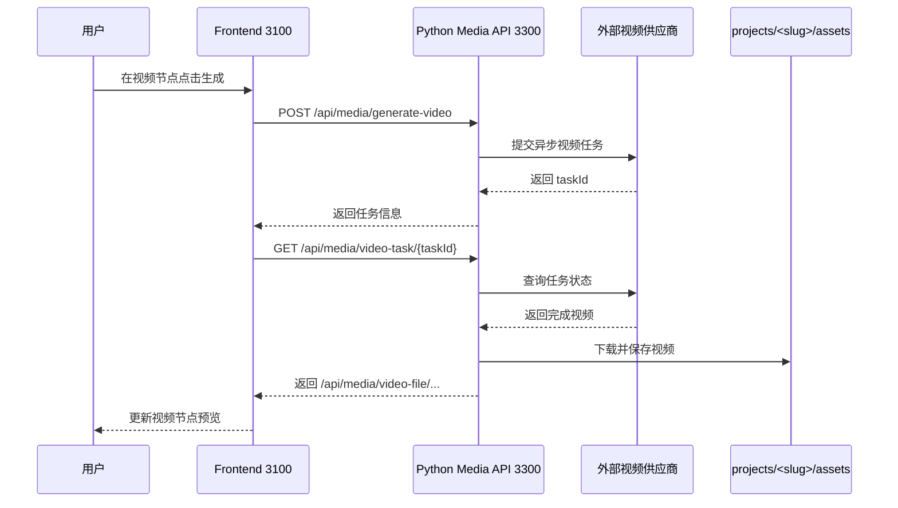

# Demiurge AI Canvas

Demiurge AI Canvas 是一个本地运行的 AI 图片/视频创作画布。项目已经拆分为多项目、多服务架构，目标是职责单一、边界清晰、长期可维护，而不是把所有能力堆在一个启动脚本里。

## 本地启动顺序

本地开发时请按下面顺序启动，三个服务分别在三个终端中运行。

### 1. 启动 Node API 服务

```powershell
cd backend\node
npm install
npm run dev
```

服务地址：

- `http://127.0.0.1:3200`
- 健康检查：`http://127.0.0.1:3200/api/node/health`

Node 服务负责工程管理、素材库、翻译、文本/图片分析、工程资产读写。

### 2. 启动 Python Media API 服务

```powershell
cd backend\python
pip install -r requirements.txt
node run-image-service-dev.mjs
```

服务地址：

- `http://127.0.0.1:3300`
- 健康检查：`http://127.0.0.1:3300/api/media/health`

Python 服务负责图片生成、视频生成、视频任务轮询、媒体文件访问和媒体处理。

### 3. 启动前端

```powershell
cd frontend
npm install
npm run dev
```

打开：

- `http://127.0.0.1:3100`

前端只负责 UI、路由、组件、状态、hooks 和前端 API 封装。

## 目录结构

```text
demiurge-ai-canvas/
  frontend/                  前端 React/Vite 项目
    package.json
    .env.example
    src/
      api/                   前端 API 封装、资源 URL 规范化
      components/            通用 UI 组件、面板、工具栏
      features/              业务功能模块
        generation/          图片/视频生成模型配置
        nodes/               React Flow 节点实现
        projects/            项目首页
      hooks/                 前端 hooks 预留目录
      router/                前端路由预留目录
      store/                 前端状态和 Context
      styles/                全局样式
      utils/                 前端工具函数

  backend/
    node/                    Node API 服务
      package.json
      .env.example
      src/
        main.js              Express 入口
        routes/              路由注册
        controllers/         HTTP 入参/出参
        services/            业务流程和派生数据
        repositories/        本地文件/索引读写
        clients/             外部模型供应商客户端
        config/              环境变量、路径、存储配置
        utils/               HTTP、媒体响应等工具

    python/                  Python Media API 服务
      requirements.txt
      .env.example
      app/
        image_generate_service.py  当前完整媒体运行时
        main.py                   FastAPI 壳入口
        core/                     配置、路径、基础设施
        routers/                  路由预留目录
        schemas/                  请求/响应结构预留目录
        services/                 媒体业务服务预留目录
        repositories/             文件读写预留目录
        models/                   模型对象预留目录
        utils/                    工具函数预留目录

  docs/                      架构、开发、阶段基线文档
  projects/                  本地工程数据
  outputs/                   未绑定工程的生成输出
  material-library/          跨工程素材库
  tools/                     本地工具和二进制依赖
  README.md
  AGENT.md
  .gitignore
```

根目录不保留业务运行脚本，也不保留根 `package.json`。每个项目独立管理自己的依赖、环境变量和启动命令。

## 架构图



## 请求时序图

### 项目打开时序



### 图片生成时序



### 视频生成时序



## API 命名空间

前端业务请求统一使用命名空间：

- `/api/node/*` 转发到 Node API 服务。
- `/api/media/*` 转发到 Python Media API 服务。

本地开发由 `frontend/vite.config.js` 配置代理：

```text
/api/node  -> http://127.0.0.1:3200
/api/media -> http://127.0.0.1:3300
```

为了兼容旧工程数据，当前仍保留这些旧路径：

- `/api/project/*`
- `/api/material-library/*`
- `/api/video-file/*`
- `/api/generate-image`
- `/api/generate-video`
- `/api/video-task/*`
- `/api/seedance-face-review`

旧路径用于读取历史工程、历史素材和历史视频，不建议新代码继续直接使用。

## 环境变量

每个服务维护自己的环境变量文件：

```text
frontend/.env.example
backend/node/.env.example
backend/python/.env.example
```

本地开发时复制为 `.env.local`：

```powershell
Copy-Item frontend\.env.example frontend\.env.local
Copy-Item backend\node\.env.example backend\node\.env.local
Copy-Item backend\python\.env.example backend\python\.env.local
```

不要把 `.env.local`、API Key、用户本地数据提交到仓库。

## 本地数据目录

```text
projects/<slug>/project_data.json
projects/<slug>/assets/
```

保存工程画布、节点、连线、视口和工程专属资产。

```text
material-library/library_data.json
material-library/seedance_subjects.json
material-library/assets/
```

保存跨工程素材库和 Seedance 主体数据。

```text
outputs/
```

保存未绑定具体工程的生成媒体、临时文件或兼容输出。

除非明确需要清理数据，不要删除这些目录。

## 验证命令

前端构建：

```powershell
cd frontend
npm run build
```

Node 服务校验：

```powershell
cd backend\node
npm run verify
```

Python 语法检查：

```powershell
cd backend\python
python -m py_compile app\image_generate_service.py app\main.py app\core\config.py app\core\media_paths.py test_image_generate.py
```

最低功能验收：

- `http://127.0.0.1:3100` 能打开首页。
- Node 健康检查通过。
- Python Media 健康检查通过。
- 项目列表、创建、加载、保存、删除正常。
- 素材库列表、素材访问正常。
- 旧图片 `/api/project/media/...` 可读取。
- 旧视频 `/api/video-file/...` 可读取。
- 浏览器首页无 broken image，无控制台错误。

## 当前状态

当前仓库已经完成多项目、多服务工程化重构基线：

- 前端、Node 服务、Python 服务已拆分。
- 根目录不再承载业务启动脚本。
- Node 已形成 controller/service/repository/client/config 分层。
- Python 已开始拆出 core 基础设施，完整媒体运行时仍保持兼容。
- 前端已按 api/components/store/features/utils/styles 收口。
- 旧工程、旧素材、旧视频路径保持兼容。
